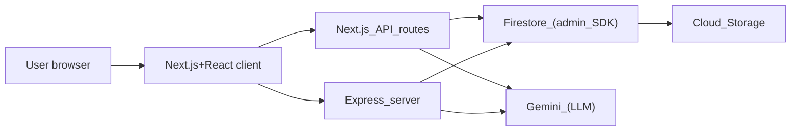
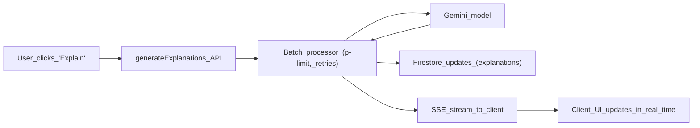

### APMaster – Latency-Aware AI Study Companion for AP Exams

**Founders & Recognition**  
Founded & Engineered by: **Siddharth Mirchandani** and **Vivana Satiani**.  
Award: **2nd Place, 2025 Congressional App Challenge**.  
Verification: [“Edison Students Secure Second Place in 2025 Congressional App Challenge.”](https://www.tapinto.net/towns/edison/milestones/edison-students-secure-second-place-in-2025-congressional-app-challenge)

APMaster is an **AI-assisted AP exam prep platform** built for students who care about **speed, clear feedback, and staying in the loop** as they learn.

The product is designed like a careful study coach:
- **Personalized practice and diagnostics** across multiple AP subjects.
- **AI-generated explanations and contextual hints** that feel like a good TA, not a black box.
- **Latency-aware backend** that batches, retries, and streams results so students see the **first token fast** instead of waiting on a spinner.

---

### 1. What You Can Do with APMaster

- **Run diagnostic and full-length tests** to find weak units and topics.
- **Practice by unit or topic** with a quiz engine that tracks accuracy, attempts, and timing.
- **Get AI explanations and extra context on demand**, including “why this is wrong” and “what you should review next.”
- **Bookmark and review** questions, maintain **score history**, and see patterns over time.
- **Operate powerful admin tools** to import, clean, and bulk-fix question banks using AI.

APMaster is both a **student-facing study experience** and a **latency-aware AI system** that uses batching, streaming, and cost controls built on top of Firestore.

---

### 2. Tech Stack (High-Level)

- **Frontend (Beauty)**
  - **Next.js + React** UI, using a modern component system (shadcn-style, Tailwind CSS).
  - **React Query + Contexts** for data fetching, cache, and app-wide state.
  - **Firebase client SDK** for auth + lightweight Firestore access where appropriate.

- **Backend & Infrastructure (Brains)**
  - **Next.js API routes** in `pages/api/**` for user-facing HTTP/JSON and SSE endpoints.
  - **Express server** in `server/**` for long-lived infrastructure, Firestore connection management, and certain batch/utility flows.
  - **Firebase Admin SDK** for privileged Firestore + Storage access (`server/firebase-admin.ts`).
  - **Firestore** as the primary data store, with **careful subcollection modeling** for high-frequency updates.
  - **Firebase DataConnect** (`dataconnect` + `dataconnect-generated`) for typed access to Firestore.

- **AI & Integrations**
  - **Google Gemini** via `@google/genai` / `@google/generative-ai` with shared configuration in `lib/gemini-models.ts`.
  - **Server-only LLM access**, wrapped in **batch processors**, **retry logic**, and **SSE-based streaming**.

The hybrid Next.js + Express architecture is intentional: Next.js focuses on **user-facing APIs and pages**, while Express runs longer-lived services and connection management that benefit from **warm, stateful processes**.

---

### 3. Hybrid Architecture – Next.js + Express

APMaster is not “just a Next.js app” and not “just an Express backend” – it’s a **hybrid**:

- **Next.js layer (`pages` and `pages/api`)**
  - Handles **all user-facing routes**: dashboard, study views, quizzes, auth flows.
  - Exposes **REST- and SSE-style API endpoints** under:
    - `pages/api/user/**` – student-facing APIs (profile, subjects, tests, state).
    - `pages/api/admin/**` – admin tooling (question imports, AI-backed maintenance).
    - Specialized AI endpoints like:
      - `pages/api/generateExplanations.ts`
      - `pages/api/generateContext.ts`
      - `pages/api/chat-explanation.ts`
  - These endpoints are optimized for **HTTP ergonomics and developer experience**: clean handlers, validation, and direct mapping to the frontend.

- **Express layer (`server/**`)**
  - Entry point: `server/index.ts`.
  - Manages **long-lived infrastructure**:
    - Firestore admin initialization (`server/firebase-admin.ts`).
    - Connection health, retries, and reconnection logic (`server/db.ts`, `server/db-health-monitor.ts`, `server/db-retry-handler.ts`).
    - Storage operations (`server/storage.ts`) and other utility endpoints.
  - Hosts **batch and integration utilities**, including:
    - `server/replit_integrations/batch/utils.ts` – concurrency-limited, retry-aware batch processors (with optional SSE helpers).

In practice:
- **Next.js API routes** are the **face** of the backend that the React app talks to.
- The **Express server** is the **muscle and connective tissue**, ideal for **heavy-duty batch processing, connection reuse, and long-running operations**.

---

### 4. Architecture Overview

#### 4.1 High-Level Request Flow

- The browser talks to the **Next.js client app**, which calls **Next.js API routes** for most user flows.
- For batchy, infra-style operations, the API routes or admin tools rely on the **Express server**, which already has **warm Firestore and Gemini connections**.
- Both layers ultimately converge on **Firestore, Cloud Storage, and Gemini**, but with **different lifecycles**:
  - Next.js routes: request–response oriented.
  - Express server: longer-lived, connection-aware processes.

#### 4.2 AI Batch Processing & SSE

- When a user triggers explanations:
  - The **Next.js endpoint** orchestrates work, often delegating to shared **batch utilities** (`server/replit_integrations/batch/utils.ts`).
  - The batch processor:
    - Caps **concurrency** (to protect rate limits and cost).
    - Uses **retry-with-backoff** on rate limits or transient failures.
    - Writes **results back to Firestore**.
    - Streams **Server-Sent Events (SSE)** back to the client.
- SSE is used not just for “status updates,” but specifically to **optimize Time To First Token (TTFT)**:
  - The client starts rendering progress or partial results as soon as Gemini returns the first items, so the user **feels** the system is instant, even when the full batch is large.

---

### 5. Data Modeling & Firestore Strategy

APMaster’s Firestore schema is designed for **per-user, frequent writes** and **fast reads**.

- **Core collections** (from `SECURITY_AUDIT.md` and implementation):
  - `users` – core user profile, roles, and high-level settings.
  - `user_subjects` – per-subject progress, scores, and metadata.
  - `user_bookmarks` – saved questions, review lists.
  - `score_history` – longitudinal performance data.
  - Question banks and test definitions stored in subject-oriented collections.

- **Subcollections vs. root collections**
  - High-churn, high-frequency state like **question state during an exam** lives in **subcollections under the user** (e.g. `users/{userId}/user_question_state` or similar patterns).
  - This design:
    - Keeps **per-user hot data localized**.
    - Plays nicely with Firestore’s indexing and security rules.
    - Makes it easy to **fan out writes per user** without hotspots on a single global collection.

- **Client vs. server access**
  - **Client-side Firestore**:
    - Initialized in `client/src/lib/firebase.ts`.
    - Used for low-risk reads/writes that benefit from immediate client-cache updates.
  - **Server-side Firestore (Admin SDK)**:
    - Centralized in `server/firebase-admin.ts` and `server/db.ts`.
    - Used for AI pipelines, administrative operations, and anything that must be **trusted, validated, and not exposed to the client**.

This data modeling strategy lets APMaster handle **frequent quiz state updates** and **AI-enriched content writes** without overloading Firestore or weakening security.

---

### 6. Latency, TTFT, and Cost Strategy

Latency isn’t an afterthought here—it is a **core design constraint**. APMaster treats AI calls as expensive (time and money) and is built around that fact.

- **Time To First Token (TTFT) via SSE**
  - Endpoints like `pages/api/generateExplanations.ts` and `pages/api/generateContext.ts` are implemented with **Server-Sent Events**.
  - The goal is not just to “show a spinner with progress”; it is to **minimize TTFT** by:
    - Streaming **the earliest available explanations** as soon as Gemini returns them.
    - Allowing the UI to show **partial results and per-question status** instead of blocking until the entire batch completes.
  - Students see the system respond quickly, which makes the product feel fast even on large workloads.

- **Batching & concurrency caps**
  - Shared batch helpers (e.g. `server/replit_integrations/batch/utils.ts`) encapsulate:
    - **Concurrency limits** using `p-limit` so we don’t overload Gemini or blow through quotas.
    - **Automatic retries with backoff** on quota/rate-limit errors via `p-retry`.
    - Optional **SSE hooks** so any batchable process can stream structured progress events.

- **Cold start and connection strategy**
  - `server/db.ts`, `server/db-health-monitor.ts`, and `server/db-retry-handler.ts` work together to:
    - **Reuse Firestore connections** across requests in the Express process.
    - Proactively detect and recover from stale or failed connections.
    - Keep the **Firestore “pipes” warm**, so when Gemini finishes a batch and we persist results, we’re not paying additional cold-start penalties.
  - This connection reuse also indirectly helps **Gemini flows**: the less time we spend reconciling DB connections, the more of our latency budget can be dedicated to **model inference and streaming tokens**.

- **Prefetching and caching**
  - **React Query + contexts** (under `client/src/contexts` and `client/src/lib/hooks`) aggressively **cache per-user state** such as progress, bookmarks, and question metadata.
  - Combined with Firestore connection reuse on the backend, this means:
    - We often already **have the instructional context** needed for an AI call locally.
    - We avoid redundant AI calls and shrink the prompt footprint, cutting **both cost and latency**.

---

### 7. Key User & Admin Flows

- **Student flows**
  - Visit `/dashboard` to see overall progress and suggested next steps.
  - Use `/study` and subject-specific views (driven by `client/src/subjects/**`) to drill into topics.
  - Start `/quiz` or full-length tests, while `pages/api/user/**` tracks:
    - Exam state (`/save-exam-state`, `/get-exam-state`, `/delete-exam-state`).
    - Unit progress (`/unit-progress`) and subject performance (`/subjects`).
  - Trigger **AI explanations** and context generation via dedicated endpoints like:
    - `pages/api/generateExplanations.ts`
    - `pages/api/generateContext.ts`
    - `pages/api/chat-explanation.ts`

- **Admin/content flows**
  - `/admin/**` pages (under `pages/admin`) expose tools for:
    - Importing question banks (`pages/api/admin/import-questions.ts` and siblings).
    - Editing and retiring questions.
    - Running **bulk AI operations** (e.g., regenerating explanations, fixing prompts or choices).
  - Many of these UI actions are backed by:
    - **Batch helpers** in `server/replit_integrations/batch/**`.
    - **Firestore + Storage** utilities in `server/db.ts` and `server/storage.ts`.

Together, these flows show how to wire **end-to-end AI features** (from UX to LLM to Firestore) in a way that is **easy to observe, resilient under load, and mindful of cost**.

---

### 8. Enterprise-Grade Security Architecture

APMaster is designed with a **production-grade security posture** suitable for handling student data and AI credentials on the server side.

- **Secrets isolation**
  - All **high-privilege credentials** (e.g. Firestore service accounts, AI API keys) are loaded **only in server runtimes** (Next.js API routes and the Express layer), never in the browser.
  - The client receives **scoped, least-privilege Firebase configuration**, while write paths that touch AI and PII are mediated by backend services.

- **Data segmentation & PII handling**
  - Per-user state is **partitioned by user** in Firestore, with security rules that scope access to the authenticated user’s documents.
  - PII and performance data are modeled so that **AI pipelines operate on opaque IDs and derived features** wherever possible, not raw identifiers.

- **Defense-in-depth**
  - Firestore and Storage security rules enforce **role-aware access** (student vs. admin) and tight scoping of read/write operations.
  - Server-side enforcement layers validate payloads, rate-limit sensitive operations, and centralize AI key usage behind narrow interfaces.

- **Operational rigor**
  - A dedicated `SECURITY_AUDIT.md` documents threat models, how secrets are stored, and what classes of logs are retained or deliberately dropped.
  - The batch + SSE architecture is designed so that **long-running AI jobs never expose raw secrets or unguarded PII to the client**, even under failure modes.

---

### 9. Future Vision & Product Evolution

- **More subjects & deeper coverage** for each AP exam.
- **Richer analytics**: per-skill mastery, timing breakdowns, and recommendation loops.
- **Pluggable model backends**, allowing us to swap Gemini for other providers with the same batching/streaming guarantees.
- **Teacher-facing tooling**: class dashboards, assignment flows, and shared test libraries.

APMaster represents our commitment to solving real-world educational challenges through solid software engineering, efficient algorithms, and user-centric design.