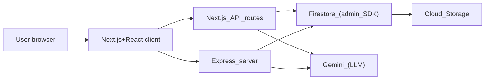
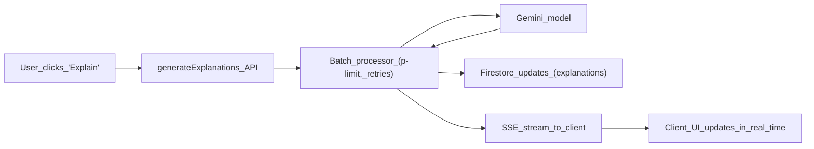

### APMaster – Latency-Aware AI Study Companion for AP Exams

APMaster is an **AI-assisted AP exam prep platform** built for students who care about **speed, feedback quality, and staying in the loop** as they learn.

The product is designed like an engineer’s study coach:
- **Personalized practice and diagnostics** across multiple AP subjects.
- **AI-generated explanations and contextual hints** that feel like a good TA, not a black box.
- **Latency-aware backend** that batches, retries, and streams results so students see the **first token fast** instead of waiting on a spinner.

---

### 1. What You Can Do with APMaster

- **Run diagnostic and full-length tests** to find weak units and topics.
- **Practice by unit or topic** with a quiz engine that tracks accuracy, attempts, and timing.
- **Get AI explanations and extra context on demand**, including “why this is wrong” and “what you should review next.”
- **Bookmark and review** questions, maintain **score history**, and see patterns over time.
- **Operate powerful admin tools** to import, clean, and bulk-fix question banks using AI.

APMaster is both a **student-facing study experience** and a **developer-grade playground** for building latency- and cost-aware AI features on top of Firestore.

---

### 2. Tech Stack (High-Level)

- **Frontend (Beauty)**
  - **Next.js + React** UI, using a modern component system (shadcn-style, Tailwind CSS).
  - **React Query + Contexts** for data fetching, cache, and app-wide state.
  - **Firebase client SDK** for auth + lightweight Firestore access where appropriate.

- **Backend & Infrastructure (Brains)**
  - **Next.js API routes** in `pages/api/**` for user-facing HTTP/JSON and SSE endpoints.
  - **Express server** in `server/**` for long-lived infrastructure, Firestore connection management, and certain batch/utility flows.
  - **Firebase Admin SDK** for privileged Firestore + Storage access (`server/firebase-admin.ts`).
  - **Firestore** as the primary data store, with **careful subcollection modeling** for high-frequency updates.
  - **Firebase DataConnect** (`dataconnect` + `dataconnect-generated`) for typed access to Firestore.

- **AI & Integrations**
  - **Google Gemini** via `@google/genai` / `@google/generative-ai` with shared configuration in `lib/gemini-models.ts`.
  - **Server-only LLM access**, wrapped in **batch processors**, **retry logic**, and **SSE-based streaming**.

The hybrid Next.js + Express architecture exists **on purpose**: Next.js focuses on **user-facing APIs and pages**, while Express hosts longer-lived services and connection management that benefit from **warm, stateful processes**.

---

### 3. Hybrid Architecture – Next.js + Express

APMaster is not “just a Next.js app” and not “just an Express backend” – it’s a **hybrid**:

- **Next.js layer (`pages` and `pages/api`)**
  - Handles **all user-facing routes**: dashboard, study views, quizzes, auth flows.
  - Exposes **REST- and SSE-style API endpoints** under:
    - `pages/api/user/**` – student-facing APIs (profile, subjects, tests, state).
    - `pages/api/admin/**` – admin tooling (question imports, AI-backed maintenance).
    - Specialized AI endpoints like:
      - `pages/api/generateExplanations.ts`
      - `pages/api/generateContext.ts`
      - `pages/api/chat-explanation.ts`
  - These endpoints are optimized for **HTTP ergonomics and developer experience**: clean handlers, validation, and direct mapping to the frontend.

- **Express layer (`server/**`)**
  - Entry point: `server/index.ts`.
  - Manages **long-lived infrastructure**:
    - Firestore admin initialization (`server/firebase-admin.ts`).
    - Connection health, retries, and reconnection logic (`server/db.ts`, `server/db-health-monitor.ts`, `server/db-retry-handler.ts`).
    - Storage operations (`server/storage.ts`) and other utility endpoints.
  - Hosts **batch and integration utilities**, including:
    - `server/replit_integrations/batch/utils.ts` – concurrency-limited, retry-aware batch processors (with optional SSE helpers).

In practice:
- **Next.js API routes** are the **face** of the backend that the React app talks to.
- The **Express server** is the **muscle and connective tissue**, ideal for **heavy-duty batch processing, connection reuse, and long-running operations**.

---

### 4. Architecture Overview

#### 4.1 High-Level Request Flow



- The browser talks to the **Next.js client app**, which calls **Next.js API routes** for most user flows.
- For batchy, infra-style operations, the API routes or admin tools rely on the **Express server**, which already has **warm Firestore and Gemini connections**.
- Both layers ultimately converge on **Firestore, Cloud Storage, and Gemini**, but with **different lifecycles**:
  - Next.js routes: request–response oriented.
  - Express server: longer-lived, connection-aware processes.

#### 4.2 AI Batch Processing & SSE



- When a user triggers explanations:
  - The **Next.js endpoint** orchestrates work, often delegating to shared **batch utilities** (`server/replit_integrations/batch/utils.ts`).
  - The batch processor:
    - Caps **concurrency** (to protect rate limits and cost).
    - Uses **retry-with-backoff** on rate limits or transient failures.
    - Writes **results back to Firestore**.
    - Streams **Server-Sent Events (SSE)** back to the client.
- SSE is used not just for “status updates,” but specifically to **optimize Time To First Token (TTFT)**:
  - The client starts rendering progress or partial results as soon as Gemini returns the first items, so the user **feels** the system is instant, even when the full batch is large.

---

### 5. Data Modeling & Firestore Strategy

APMaster’s Firestore schema is optimized for **per-user, high-frequency writes** and **low-latency reads**.

- **Core collections** (from `SECURITY_AUDIT.md` and implementation):
  - `users` – core user profile, roles, and high-level settings.
  - `user_subjects` – per-subject progress, scores, and metadata.
  - `user_bookmarks` – saved questions, review lists.
  - `score_history` – longitudinal performance data.
  - Question banks and test definitions stored in subject-oriented collections.

- **Subcollections vs. root collections**
  - High-churn, high-frequency state like **question state during an exam** lives in **subcollections under the user** (e.g. `users/{userId}/user_question_state` or similar patterns).
  - This design:
    - Keeps **per-user hot data localized**.
    - Plays nicely with Firestore’s indexing and security rules.
    - Makes it easy to **fan out writes per user** without hotspots on a single global collection.

- **Client vs. server access**
  - **Client-side Firestore**:
    - Initialized in `client/src/lib/firebase.ts`.
    - Used for low-risk reads/writes that benefit from immediate client-cache updates.
  - **Server-side Firestore (Admin SDK)**:
    - Centralized in `server/firebase-admin.ts` and `server/db.ts`.
    - Used for AI pipelines, administrative operations, and anything that must be **trusted, validated, and not exposed to the client**.

This data modeling strategy is what lets APMaster support **frequent quiz state updates** and **AI-enriched content writes** without melting Firestore or compromising security.

---

### 6. Latency, TTFT, and Cost Strategy

Latency isn’t an afterthought here—it’s a **first-class constraint**. APMaster assumes that AI calls are expensive (time and money), and designs around that.

- **Time To First Token (TTFT) via SSE**
  - Endpoints like `pages/api/generateExplanations.ts` and `pages/api/generateContext.ts` are implemented with **Server-Sent Events**.
  - The goal is not just to “show a spinner with progress”; it is to **minimize TTFT** by:
    - Streaming **the earliest available explanations** as soon as Gemini returns them.
    - Allowing the UI to show **partial results and per-question status** instead of blocking until the entire batch completes.
  - Users see the system “breathing” with them, which dramatically improves perceived speed.

- **Batching & concurrency caps**
  - Shared batch helpers (e.g. `server/replit_integrations/batch/utils.ts`) encapsulate:
    - **Concurrency limits** using `p-limit` so we don’t overload Gemini or blow through quotas.
    - **Automatic retries with backoff** on quota/rate-limit errors via `p-retry`.
    - Optional **SSE hooks** so any batchable process can stream structured progress events.

- **Cold start and connection strategy**
  - `server/db.ts`, `server/db-health-monitor.ts`, and `server/db-retry-handler.ts` work together to:
    - **Reuse Firestore connections** across requests in the Express process.
    - Proactively detect and recover from stale or failed connections.
    - Keep the **Firestore “pipes” warm**, so when Gemini finishes a batch and we persist results, we’re not paying additional cold-start penalties.
  - This connection reuse also indirectly helps **Gemini flows**: the less time we spend reconciling DB connections, the more of our latency budget can be dedicated to **model inference and streaming tokens**.

- **Prefetching and caching**
  - **React Query + contexts** (under `client/src/contexts` and `client/src/lib/hooks`) aggressively **cache per-user state** such as progress, bookmarks, and question metadata.
  - Combined with Firestore connection reuse on the backend, this means:
    - We often already **have the instructional context** needed for an AI call locally.
    - We avoid redundant AI calls and shrink the prompt footprint, cutting **both cost and latency**.

---

### 7. Key User & Admin Flows

- **Student flows**
  - Visit `/dashboard` to see overall progress and suggested next steps.
  - Use `/study` and subject-specific views (driven by `client/src/subjects/**`) to drill into topics.
  - Start `/quiz` or full-length tests, while `pages/api/user/**` tracks:
    - Exam state (`/save-exam-state`, `/get-exam-state`, `/delete-exam-state`).
    - Unit progress (`/unit-progress`) and subject performance (`/subjects`).
  - Trigger **AI explanations** and context generation via dedicated endpoints like:
    - `pages/api/generateExplanations.ts`
    - `pages/api/generateContext.ts`
    - `pages/api/chat-explanation.ts`

- **Admin/content flows**
  - `/admin/**` pages (under `pages/admin`) expose tools for:
    - Importing question banks (`pages/api/admin/import-questions.ts` and siblings).
    - Editing and retiring questions.
    - Running **bulk AI operations** (e.g., regenerating explanations, fixing prompts or choices).
  - Many of these UI actions are backed by:
    - **Batch helpers** in `server/replit_integrations/batch/**`.
    - **Firestore + Storage** utilities in `server/db.ts` and `server/storage.ts`.

Together, these flows demonstrate how to wire **end-to-end AI features** (from UX to LLM to Firestore) in a way that is **observable, resilient, and cost-aware**.

---

### 8. Getting Started (Local Development)

#### 8.1 Project Map – Where Things Live

Think of the repo in two halves: **beauty** (frontend) and **brains** (backend/AI).

- **Beauty – Frontend**
  - `client/src/components/**` – quiz engine UI, landing sections, shared UI kit.
  - `client/src/pages/**` – user-facing pages and routing.
  - `client/src/contexts/**` – auth, React Query, and app-wide state.
  - `client/src/subjects/**` – subject metadata (units, sections, lessons).

- **Brains – Backend & AI**
  - `pages/api/**` – Next.js API routes (user/admin/waitlist + AI endpoints).
  - `server/**` – Express server, Firestore admin, storage, and batch utilities.
  - `lib/gemini-models.ts` – Gemini model configuration and selection.
  - `dataconnect/**` & `dataconnect-generated/**` – Firestore DataConnect schemas + generated clients.

Once you have that mental map, it’s straightforward to drop into a feature and know **which side to modify**.

#### 8.2 Prerequisites

- Node.js (LTS recommended).
- `pnpm`, `npm`, or `yarn`.
- A **Firebase project** with Firestore + Storage enabled.
- A **Gemini API key** (or compatible AI integration that matches the environment variable interface).

#### 8.3 Environment Setup

Create a `.env.local` (for Next.js) and `.env` (for Express) with, at minimum:

- Firebase configuration:
  - `FIREBASE_PROJECT_ID`
  - `FIREBASE_API_KEY`
  - `FIREBASE_AUTH_DOMAIN`
  - `FIREBASE_STORAGE_BUCKET`
  - Any other fields used in `client/src/lib/firebase.ts` and `server/firebase-admin.ts`.
- AI configuration:
  - `GEMINI_API_KEY` **or** `AI_INTEGRATIONS_GEMINI_API_KEY`
  - Optional: `AI_INTEGRATIONS_GEMINI_BASE_URL`

You can inspect `lib/gemini-models.ts`, `server/firebase-admin.ts`, and `client/src/lib/firebase.ts` for the exact variables used in your branch.

#### 8.4 Running the App

From the repo root (`ApMasterAi`):

```bash
# Install dependencies
pnpm install

# OR
npm install

# Run the Next.js app (pages + API routes)
pnpm dev

# In another terminal, if you use the Express server independently:
pnpm dev:server   # or the corresponding script in package.json
```

Then open the URL printed by the dev server (typically `http://localhost:3000`) to access the UI.

> **Note**: Without valid Firebase and Gemini credentials, the UI will load, but many data- and AI-driven flows will either be disabled or return mocked/error responses.

---

### 9. Environment, Security & Safety

- **Key environment variables**
  - Firebase:
    - `FIREBASE_PROJECT_ID`, `FIREBASE_API_KEY`, `FIREBASE_AUTH_DOMAIN`, `FIREBASE_STORAGE_BUCKET`, etc.
  - Admin / backend:
    - `FIREBASE_SERVICE_ACCOUNT` (JSON or path used by `server/firebase-admin.ts`).
  - AI:
    - `GEMINI_API_KEY` or `AI_INTEGRATIONS_GEMINI_API_KEY`.
    - Optional `AI_INTEGRATIONS_GEMINI_BASE_URL`.

- **Client vs. server**
  - Anything that grants **privileged access** (e.g. `FIREBASE_SERVICE_ACCOUNT`, `GEMINI_API_KEY`) must be treated as **server-only**.
  - Client-visible Firebase config uses the usual restricted keys safe for browser initialization.

> **Security Warning**
>
> - **Never** expose `FIREBASE_SERVICE_ACCOUNT`, `GEMINI_API_KEY`, or any equivalent secrets in client-side `.env` files, frontend code, or public repos.
> - In this project, AI keys and service accounts are intended to live **only on the server side**:
>   - `.env` consumed by the Express server.
>   - Server-side Next.js environment variables (not prefixed for client exposure).
> - If you’re unsure whether an env var is safe to expose, **assume it is not** and wire it through the backend instead.

- **Rules & audits**
  - `firestore.rules` and `storage.rules` define security posture for data and files.
  - `SECURITY_AUDIT.md` documents:
    - PII considerations.
    - How AI keys are handled.
    - Logging and monitoring constraints.

---

### 10. Contributing & Extending

- **Good first extensions**
  - Add a new AP subject by wiring a subject definition in `client/src/subjects` and extending relevant question collections.
  - Introduce a new AI-powered helper endpoint (e.g. explanation variant, hint generator) by:
    - Creating a new `pages/api/**` route.
    - Reusing the **batch + retry utilities** from `server/replit_integrations/batch/utils.ts`.
  - Build a small analytics panel in `/admin` for instructors or admins.

- **Guidelines**
  - Keep **AI calls server-side**, always passed through a thin, testable abstraction.
  - When in doubt, **opt for streaming (SSE) over blocking responses** for anything that might take longer than a second.
  - Follow existing TypeScript patterns and use shared types from `shared/**` where possible.

PRs, architectural experiments, and “what if we tried X?” ideas are welcome. This codebase is intentionally structured to be a **teaching tool for AI + latency-aware design**, not just a closed-box product.

---

### 11. Roadmap (Aspirational)

- **More subjects & deeper coverage** for each AP exam.
- **Richer analytics**: per-skill mastery, timing breakdowns, and recommendation loops.
- **Pluggable model backends**, allowing you to swap Gemini for other providers with the same batching/streaming guarantees.
- **Teacher-facing tooling**: class dashboards, assignment flows, and shared test libraries.

If you’re reading this on the repo’s front page, you’re exactly the kind of person this README was written for—someone who cares about how things are built, not just that they work.