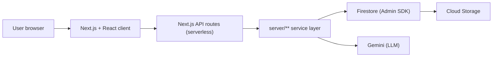
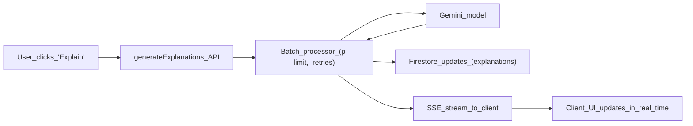

### APMaster – Latency-Aware AI Study Companion for AP Exams

**Founders & Recognition**  
Founded & Engineered by: **Siddharth Mirchandani** and **Vivana Satiani**.  
Award: **2nd Place, 2025 Congressional App Challenge**.  
Verification: [“Edison Students Secure Second Place in 2025 Congressional App Challenge.”](https://www.tapinto.net/towns/edison/milestones/edison-students-secure-second-place-in-2025-congressional-app-challenge)

APMaster is an **AI-assisted AP exam prep platform** built for students who care about **speed, clear feedback, and staying in the loop** as they learn.

**Built with:** [**TypeScript**](https://www.typescriptlang.org/) · [**React**](https://react.dev/) · [**Next.js**](https://nextjs.org/) (Pages Router)

The codebase is **TypeScript end-to-end**—from React components in `client/src/**` through Next.js pages and API routes in `pages/**`, to a shared TypeScript service layer in `server/**`. The student UI is a **React 18** app delivered by **Next.js 14**; API logic runs as serverless functions on Node with shared types, `tsc` validation (`npm run check`), and Zod-backed request validation.

APMaster is engineered around the primary friction points of AI study tools: slow generation, hallucinated context, and unsustainable API costs. By treating LLM token usage as a first-class constraint — caching aggressively and calling the model only for net-new work — the platform keeps its marginal cost per student low enough to offer free.
- **Personalized practice and diagnostics** across multiple AP subjects.
- **AI-generated explanations and contextual hints** that feel like a good TA, not a black box.
- **Cost-aware backend** that leans on caching, batching, and streaming to minimize API token usage and keep the platform free for students.

---

### 1. What You Can Do with APMaster

- **Run diagnostic and full-length tests** to find weak units and topics.
- **Practice by unit or topic** with a quiz engine that tracks accuracy, attempts, and timing.
- **Get AI explanations and extra context on demand**, including “why this is wrong” and “what you should review next.”
- **Bookmark and review** questions, maintain **score history**, and see patterns over time.
- **Admin-side content QC**: structured imports, cleaning and normalization, AI-backed explanations and remediation, and explicit verification so the live bank stays accurate and consistent.

APMaster is both a **student-facing study experience** and a **latency-aware AI system** that uses batching, streaming, and cost controls built on top of Firestore.

---

### 2. Tech Stack (High-Level)

| Layer | Technologies |
| --- | --- |
| **Language** | **TypeScript** end-to-end — client, Next.js pages/API, and the `server/**` service layer (`tsconfig.json`, `npm run check`) |
| **UI** | **React 18** components + hooks (`client/src/**`) |
| **App framework** | **Next.js 14** — pages, routing, and serverless API routes (`pages/**`, `pages/api/**`) |
| **Service layer** | **TypeScript modules** in `server/**` — Firestore access, batch utilities, and domain logic imported by the API routes |

- **Frontend (React + Next.js + TypeScript)**
  - **Next.js** for file-based routing, SSR/SSG where used, and colocated **API routes** under `pages/api/**`.
  - **React** UI with a modern component system (shadcn-style, Tailwind CSS).
  - **TanStack React Query + React Context** for data fetching, cache, and app-wide state.
  - **Firebase client SDK** for auth + lightweight Firestore access where appropriate.

- **Backend & Infrastructure (TypeScript on Node)**
  - **Next.js API routes** (`pages/api/**`) — typed handlers for user-facing HTTP/JSON and SSE endpoints.
  - **Service layer** (`server/**`) — TypeScript modules for Firestore access, connection health/retry, batch utilities, and domain logic, imported directly by the API routes.
  - **Firebase Admin SDK** for privileged Firestore + Storage access (`server/firebase-admin.ts`).
  - **Firestore** as the primary data store, with **careful subcollection modeling** for high-frequency updates.

- **AI & Integrations**
  - **Google Gemini** via `@google/genai` / `@google/generative-ai` with shared configuration in `lib/gemini-models.ts`.
  - **Server-only LLM access**, wrapped in **batch processors**, **retry logic**, and **SSE-based streaming**.

The split is intentional: thin Next.js API handlers own HTTP concerns (auth, validation, response shape), while the `server/**` modules hold the reusable domain logic, Firestore access, and batch machinery — so the same service code backs both student endpoints and admin tooling.

---

### 3. Backend Architecture — Layered Next.js Services

The backend is a Next.js (Pages Router) app deployed on Vercel: every endpoint is a **serverless function** under `pages/api/**`, layered over a shared TypeScript service module set in `server/**`.

- **Next.js layer (`pages` and `pages/api`)** — React pages and typed API handlers
  - Handles **all user-facing routes**: dashboard, study views, quizzes, auth flows.
  - Exposes **REST- and SSE-style API endpoints** under:
    - `pages/api/user/**` – student-facing APIs (profile, subjects, tests, state).
    - `pages/api/admin/**` – content QC (imports, cleaning, AI-backed regeneration, question verification).
    - Specialized AI endpoints like:
      - `pages/api/generateExplanations.ts`
      - `pages/api/generateContext.ts`
      - `pages/api/chat-explanation.ts`
  - These endpoints are optimized for **HTTP ergonomics and developer experience**: clean handlers, validation, and direct mapping to the frontend.

- **Service layer (`server/**`)** — Node/TypeScript modules imported by the API routes (not a separate running server)
  - Firestore Admin initialization as a **module-scoped singleton** (`server/firebase-admin.ts`), reused across invocations on a warm function instance.
  - Connection management and retry/backoff logic (`server/db.ts`, `server/db-retry-handler.ts`).
  - Storage and persistence helpers (`server/storage.ts`).
  - **Batch and integration utilities** — `server/replit_integrations/batch/utils.ts` provides concurrency-limited, retry-aware batch processors (with optional SSE helpers).

In practice the API routes stay thin: they authenticate, validate, and delegate to `server/**`, which holds the reusable logic. Keeping that logic in a module layer (rather than inline per handler) is what lets the same code back student endpoints, admin QC tools, and one-off scripts.

---

### 4. Architecture Overview

#### 4.1 High-Level Request Flow

- The browser talks to the **Next.js client app**, which calls **Next.js API routes** for all user flows.
- Each route authenticates and validates, then delegates to the **`server/**` service layer** for Firestore access, Gemini calls, and batch work.
- Firestore and Gemini clients are initialized once per function instance and **reused while it stays warm**, so back-to-back requests avoid repeated cold initialization.

#### 4.2 AI Batch Processing & SSE

- When a user triggers explanations:
  - The **Next.js endpoint** orchestrates work, often delegating to shared **batch utilities** (`server/replit_integrations/batch/utils.ts`).
  - The batch processor:
    - Caps **concurrency** (to protect rate limits and cost).
    - Uses **retry-with-backoff** on rate limits or transient failures.
    - Writes **results back to Firestore**.
    - Streams **Server-Sent Events (SSE)** back to the client.
- SSE is used not just for “status updates,” but specifically to **optimize Time To First Token (TTFT)**:
  - The client starts rendering progress or partial results as soon as Gemini returns the first items, so the user **feels** the system is instant, even when the full batch is large.

---

### 5. Data Modeling & Firestore Strategy

APMaster’s Firestore schema is designed for **per-user, frequent writes** and **fast reads**.

- **Core collections** (from `SECURITY_AUDIT.md` and implementation):
  - `users` – core user profile, roles, and high-level settings.
  - `user_subjects` – per-subject progress, scores, and metadata, with **embedded unit-progress** and per-test subcollections (`fullLengthTests`, `diagnosticTests`, `unitQuizResults`) that compose into the dashboard read path.
  - `user_bookmarks` – saved questions, review lists.
  - `score_history` – longitudinal performance data.
  - Question banks and test definitions stored in subject-oriented collections.

- **Subcollections vs. root collections**
  - High-churn, high-frequency state like **question state during an exam** lives in **subcollections under the user** (e.g. `users/{userId}/user_question_state` or similar patterns).
  - This design:
    - Keeps **per-user hot data localized**.
    - Plays nicely with Firestore’s indexing and security rules.
    - Makes it easy to **fan out writes per user** without hotspots on a single global collection.

- **Client vs. server access**
  - **Client-side Firestore**:
    - Initialized in `client/src/lib/firebase.ts`.
    - Used for low-risk reads/writes that benefit from immediate client-cache updates.
  - **Server-side Firestore (Admin SDK)**:
    - Centralized in `server/firebase-admin.ts` and `server/db.ts`.
    - Used for AI pipelines, administrative operations, and anything that must be **trusted, validated, and not exposed to the client**.

This data modeling strategy lets APMaster handle **frequent quiz state updates** and **AI-enriched content writes** without overloading Firestore or weakening security.

---

### 6. Unit Economics, Cost Architecture, & Latency

Latency isn’t an afterthought here—it is a **core design constraint**. APMaster treats AI calls as expensive (time and money) and is built around that fact.

- **Time To First Token (TTFT) via SSE**
  - Endpoints like `pages/api/generateExplanations.ts` and `pages/api/generateContext.ts` are implemented with **Server-Sent Events**.
  - The goal is not just to “show a spinner with progress”; it is to **minimize TTFT** by:
    - Streaming **the earliest available explanations** as soon as Gemini returns them.
    - Allowing the UI to show **partial results and per-question status** instead of blocking until the entire batch completes.
  - Students see the system respond quickly, which makes the product feel fast even on large workloads.

- **Batching & concurrency caps**
  - Shared batch helpers (e.g. `server/replit_integrations/batch/utils.ts`) encapsulate:
    - **Concurrency limits** using `p-limit` so we don’t overload Gemini or blow through quotas.
    - **Automatic retries with backoff** on quota/rate-limit errors via `p-retry`.
    - Optional **SSE hooks** so any batchable process can stream structured progress events.

- **Cold start and connection strategy**
  - `server/db.ts` and `server/db-retry-handler.ts` work together to:
    - **Reuse Firestore connections** across invocations on a warm serverless instance (module-scoped Admin SDK singletons).
    - Wrap database operations in **retry-with-backoff** so transient failures don't surface to the user.
    - Keep the **Firestore “pipes” warm**, so when Gemini finishes a batch and we persist results, we’re not paying additional cold-start penalties.
  - This connection reuse also indirectly helps **Gemini flows**: the less time we spend reconciling DB connections, the more of our latency budget can be dedicated to **model inference and streaming tokens**.

- **Cache-First Architecture & Cost Avoidance**
  - We utilize React Query + Contexts to aggressively pre-fetch and cache per-user state (progress, bookmarks, question metadata) locally.
  - **How it saves AI costs:** By ensuring the client and backend already hold the necessary instructional context via low-cost Firestore reads, we eliminate redundant LLM calls. The AI is only triggered for net-new generative tasks, rather than re-evaluating existing state.
  - **Why it matters:** caching per-user state in low-cost Firestore reads keeps redundant LLM calls — the dominant cost — off the hot path, which is what makes a free tier sustainable as usage grows.

- **Read-Path Latency: Dashboard Composition**
  - The dashboard is the highest-traffic authenticated view, so its data path is **composed into a single warm round-trip** instead of a fan-out of per-card requests. `GET /api/user/subjects?includeTestHistory=1` returns each subject with its **embedded unit-progress** alongside a **per-subject test-history map**; the `fullLengthTests`, `diagnosticTests`, and `unitQuizResults` subcollections are read **concurrently** (`Promise.all`) and projected to only the fields the dashboard needs (Firestore `.select(...)`). History is resolved for **active subjects only** — archived courses render as a name-only list and never trigger reads.
  - **Identity resolution is cached.** Token verification, the ban check, and the Firebase-UID → internal-user lookup sit on every authenticated request. The ban check and user lookup run **concurrently**, and the stable UID → userId mapping is **memoized in warm-instance memory**, so repeat requests skip the Firestore hop entirely.
  - **Stale-while-revalidate on the client.** React Query holds dashboard state with a short `staleTime` and `keepPreviousData`, so in-app navigation paints **instantly from cache** while any refresh happens in the background. Freshness is guaranteed by **prefix invalidation**: mutating flows (adding a course, completing a quiz or diagnostic) invalidate the `["subjects"]` query key, forcing a fresh read on the next view.
  - **Static config is cached at the edge.** Read-only configuration such as per-unit difficulty is served with long-lived `Cache-Control` (`max-age` / `s-maxage` + `stale-while-revalidate`), so repeated reads resolve from the browser/CDN rather than re-invoking the function on every visit.
  - **Profile sync is idempotent per session.** Auth-state restoration syncs the user profile **once per session per UID** (covering first sign-in and attribution), rather than issuing an awaited write on every navigation.

---

### 7. Key User & Admin Flows

- **Student flows**
  - Visit `/dashboard` to see overall progress and suggested next steps.
  - Use `/study` and subject-specific views (driven by `client/src/subjects/**`) to drill into topics.
  - Start `/quiz` or full-length tests, while `pages/api/user/**` tracks:
    - Exam state (`/save-exam-state`, `/get-exam-state`, `/delete-exam-state`).
    - Unit progress (`/unit-progress`) and subject performance (`/subjects`).
  - Trigger **AI explanations** and context generation via dedicated endpoints like:
    - `pages/api/generateExplanations.ts`
    - `pages/api/generateContext.ts`
    - `pages/api/chat-explanation.ts`

- **Admin / content quality (QC)**
  - **Features on `/admin/**`** (`pages/admin`): bank imports (`pages/api/admin/import-questions.ts` and related routes), per-question and bulk edits (`pages/api/admin/questions/**`), retirement and deletion, plus migration-style passes (images, study notes, slugs) when the corpus needs a controlled update.
  - **How cleaning works**: repair and normalization routes (e.g. unit assignment, recategorization, difficulty tagging) and bulk jobs use the same **concurrency-limited, retry-aware batch processors** (`server/replit_integrations/batch/**`) as student-facing AI flows, with writes flowing through **Firebase Admin** and **`server/db.ts` / `server/storage.ts`** so changes are predictable and traceable.
  - **How explanations and study content are generated for the bank**: admin endpoints (e.g. `pages/api/admin/generate-study-notes.ts`, `re-generate-study-notes.ts`) reuse the shared **Gemini** setup and Firestore persistence patterns as the study UI, so regenerated text becomes the **canonical, reviewed** copy students see.
  - **How verification fits in**: `pages/api/admin/verify-questions.ts` supports dedicated checks on items; **server-side admin gating** (env-configured operators, not client flags—see `SECURITY_AUDIT.md`) and logging guidance for imports and bulk writes keep QC actions **scoped and auditable**.

Together, these flows show how to wire **end-to-end AI features** (from UX to LLM to Firestore) in a way that is **easy to observe, resilient under load, and mindful of cost**.

---

### 8. Security & Data Handling

APMaster handles student data and AI credentials behind a server-side trust boundary, with per-user access scoped by Firestore security rules.

- **Secrets isolation**
  - All **high-privilege credentials** (e.g. Firestore service accounts, AI API keys) are loaded **only in server runtimes** (Next.js API routes / the `server/**` layer), never in the browser.
  - The client receives **scoped, least-privilege Firebase configuration**, while write paths that touch AI and PII are mediated by backend services.

- **Data segmentation**
  - Per-user state is **partitioned by user** in Firestore, with security rules that scope access to the authenticated user's own documents (`request.auth.uid == userId`).
  - Shared content (courses, question banks) is **client-readable but client-immutable** — writes are allowed only through the Admin SDK on the server.

- **Server-side enforcement**
  - Firestore and Storage rules scope read/write access per user, and admin-only mutations are gated **server-side** rather than by client flags (see `SECURITY_AUDIT.md`).
  - API handlers validate payloads with **Zod**, and AI keys stay behind server-only modules; upstream Gemini rate limits are absorbed with **retry-and-backoff** so transient quota errors don't surface to users.

- **Operational rigor**
  - A dedicated `SECURITY_AUDIT.md` documents threat models, how secrets are stored, and what classes of logs are retained or deliberately dropped.
  - The batch + SSE architecture is designed so that **long-running AI jobs never expose raw secrets or unguarded PII to the client**, even under failure modes.

---

### 9. Future Vision & Product Evolution

- **More subjects & deeper coverage** for each AP exam.
- **Richer analytics**: per-skill mastery, timing breakdowns, and recommendation loops.
- **Pluggable model backends**, allowing us to swap Gemini for other providers with the same batching/streaming guarantees.
- **Teacher-facing tooling**: class dashboards, assignment flows, and shared test libraries.

APMaster shows how a few systems principles — concurrency control, streaming for low time-to-first-token, and cache-first state management — turn a thin AI wrapper into a responsive, cost-efficient product.